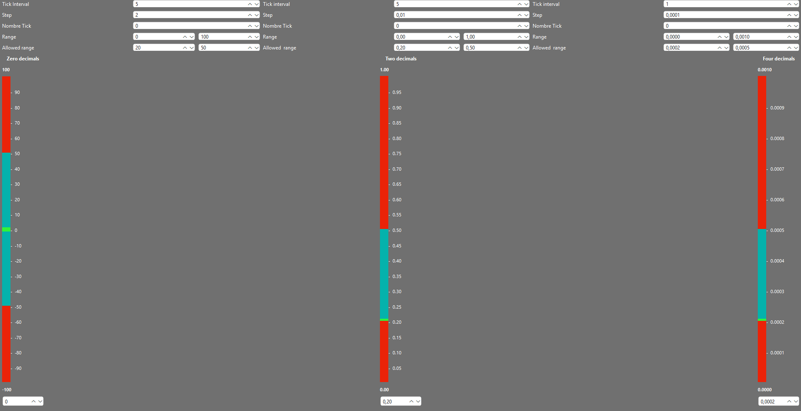

Qt double interval QSlider

A customizable high-precision numeric slider written in C++/Qt.
This widget supports double precision, user-defined ranges, allowed sub-ranges, step sizes, and configurable decimal precision (0, 2, 4 decimals, etc.).
It is designed for applications that require precise floating-point input, such as scientific tools, simulation parameters, audio DSP, or graphics editors.
